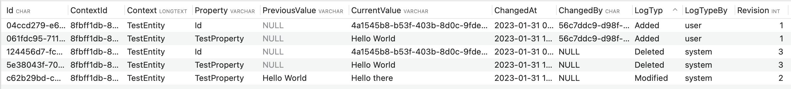

# easyLog
DB Context Logger independent of the database driver

## History
We decided to use MYsql in our company for our database provider. 
Once we needed to log anything what changed at the entity we cannot use some stuff like temporal table or something else. 
So we developed an similar framework to log changes to the entity by the easiest way

## Description
This project is an easy way to log any entity changes by the dbContext wether you **added**, **modified** or **delete** an entity. 
Your project should be structured according to the repository pattern. Your repository just needs to inherit from the interface.

Once you configured everthing its very easy to log your changes.

the log table have this structure:
| Syntax      | Description |
| ----------- | ----------- |
| Id          | Generated PK
| Context   | Which entity has changed        |
| ContextId   | if the changed entity got a id        |
| Property   | the property name of the changed entity        |
| PreviousValue   | the previous value of the changed property        |
| CurrentValue   | the previous value of the changed property        |
| ChangedAt   | When does it change        |
| ChangedBy   | who changed it        |
| LogType   | modifed/added/deleted        |
| LogTypeBy   | user / system        |
| Revision   | in which "step" changed anything        |

## How to use
### inherit your repository
The repository should inherit from the Interface ```IRepository```. The interface implemented two Methods.

1. `SaveChangesWithLog(Guid? userId, Cancellationtoken token)`

 This method will save any changes at your entity which are saved in the ef core changetracker.
The userId should be this one who changed the entity. if there is no userId given, the log entry will saved it as an "system" changed event

2. SaveChangesWithLog(Guid? userId, IReadOnlyList<strings> propertiesToIgnore, Cancellationtoken token)

This method is similar to the first one but you can give the method a list of property names which will not be logged from your entity.

### configuration
First thing first.
Before we can use the framework, we have to create an migrationscript and configure the entity model builder. your migratescript and modelbuilder which you created should look like this

```csharp
public void Configure(EntityTypeBuilder<LogEntry> builder)
{
    builder.ToTable("Logs");
}
```
You have to use the entity `LogEntry`

```csharp
migrationBuilder.CreateTable(
    name: "Logs",
    columns: table => new
    {
       Id = table.Column<Guid>(type: "char(36)", nullable: false, collation: "utf8mb4_unicode_ci"),
       ContextId = table.Column<Guid>(type: "char(36)", nullable: false, collation: "utf8mb4_unicode_ci"),
       Context = table.Column<string>(type: "longtext", nullable: false, collation: "utf8mb4_unicode_ci").Annotation("MySql:CharSet", "utf8mb4"),
       Property = table.Column<string>(type: "varchar(255)", maxLength: 255, nullable: false, collation: "utf8mb4_unicode_ci").Annotation("MySql:CharSet", "utf8mb4"),
       PreviousValue = table.Column<string>(type: "varchar(255)", maxLength: 255, nullable: true, collation: "utf8mb4_unicode_ci").Annotation("MySql:CharSet", "utf8mb4"),
       CurrentValue = table.Column<string>(type: "varchar(255)", maxLength: 255, nullable: true, collation: "utf8mb4_unicode_ci").Annotation("MySql:CharSet", "utf8mb4"),
       ChangedAt = table.Column<DateTime>(type: "datetime(6)", nullable: false),
       ChangedBy = table.Column<Guid>(type: "char(36)", nullable: true, collation: "utf8mb4_unicode_ci"),
       LogType = table.Column<string>(type: "varchar(10)", maxLength: 255, nullable: true, collation: "utf8mb4_unicode_ci")            .Annotation("MySql:CharSet", "utf8mb4"),
       LogTypeBy = table.Column<string>(type: "varchar(10)", maxLength: 255, nullable: true, collation: "utf8mb4_unicode_ci")            .Annotation("MySql:CharSet", "utf8mb4"),
       Revision = table.Column<int>(type: "int", maxLength: 10, nullable: false)

    },
    constraints: table =>
    {
       table.PrimaryKey("PK_Logs", x => x.Id);
    })
    .Annotation("MySql:CharSet", "utf8mb4")
    .Annotation("Relational:Collation", "utf8mb4_unicode_ci");
```
### how to create an entry
The only you have to do is to use your repository which inherits the IRepostory and use one of the SaveChangesWithLog Methods

### result
Once you create a logentry your table should look like this


### happy logging

thanks to [sami](https://github.com/SamiSul) for support 

visit our company [traperto](https://www.traperto.com)
